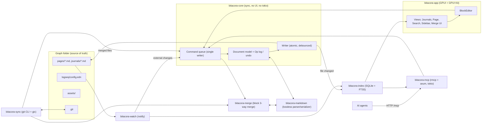

# Bitacora — Architecture

Bitacora is a cross-platform (Linux, macOS, Windows) desktop outliner written in Rust with a GPUI / [GPUI Kit](https://gpui-kit.com/) UI. It reads and writes **Logseq Markdown graphs** byte-compatibly, keeps its own SQLite index for fast navigation and search, syncs the graph with a git remote automatically, and runs an always-on **MCP server over Streamable HTTP** so AI agents can read and edit the graph.

This page is the entry point to the design. Detailed analyses and designs live in sibling pages; decisions taken across them are recorded in the ADR section below.

## 1. Goals

| # | Goal | MVP |
|---|---|---|
| G1 | 100% compatible with Logseq file graphs (0.10.x): same paths, file names, Markdown dialect, round-trip safe | Yes |
| G2 | Block outliner editing with the core Logseq keyboard model | Yes |
| G3 | Own indexing in SQLite (FTS5) — fast search, backlinks, journals, tasks | Yes |
| G4 | Automatic git sync; metadata conflicts auto-resolved; content conflicts shown visually per block; never leave conflict markers in files | Yes (basic), visual merge UI in M3 |
| G5 | MCP server over HTTP (localhost, token auth) | Yes (read tools + safe writes) |
| G6 | Cross-platform packaging and auto-update | M4 |

Non-goals (for now): Logseq DB graphs, Logseq Sync, plugins (JS), whiteboards editing, org-mode editing (`.org` files are preserved and indexed read-only), mobile.

## 2. Source documents

Logseq analysis (reference snapshot: Logseq tag `0.10.15`, file-graph code line):

- [[01-file-graph-layout]] — folders, config.edn, title ↔ file name encoding, journals, assets, rename/delete/backup behaviour.
- [[02-markdown-block-syntax]] — outline grammar, properties, refs, tasks, macros, serialization quirks, content vs metadata properties.
- [[03-parsing-indexing-search]] — parse pipeline, data model, path-refs, search, query DSL.
- [[04-editor-outliner-operations]] — editing model, outliner ops, write path, undo, shortcuts.
- [[05-git-and-apis]] — Logseq git auto-commit, HTTP API, plugin API surface.

Rust stack:

- [[gpui-and-gpui-kit]] — GPUI fundamentals, GPUI Kit components, text-editing strategy.
- [[crate-stack]] — crates, versions, workspace layout, CI matrix.
- [[block-editor-spike-report]] — ADR-002 spike: custom block text element, IME, 1,000-block performance, Textarea fallback, go/no-go.

Bitacora designs:

- [[block-editor]] — document model, `Op` enum, transactions/undo, byte-preserving serializer, GPUI editor.
- [[sqlite-index-schema]] — DDL, indexing pipeline, search, query DSL → SQL.
- [[git-sync-merge]] — sync loop, git backend, block-aware 3-way merge, conflict UI.
- [[mcp-server]] — rmcp + axum Streamable HTTP, tools, resources, security.

## 3. System overview

Key rules:

1. **Files are the source of truth.** The SQLite index is a disposable cache, rebuildable from the graph at any time.
2. **Single writer.** UI, MCP and sync all mutate through the core command queue, so every change gets undo, echo suppression and consistent indexing.
3. **Byte-preserving writes.** Untouched blocks are written back verbatim; edited blocks use Logseq's canonical form. Minimal diffs → cleaner git history and merges.
4. **Only `bitacora-app` depends on GPUI Kit.** Everything else builds and tests headless.

## 4. Workspace layout

See [[crate-stack]] §5. Summary:

| Crate | Responsibility |
|---|---|
| `bitacora-markdown` | Lossless outline splitter, property/ref/inline scanners, serializer, round-trip tests |
| `bitacora-config` | `config.edn` read + comment-preserving edits; app settings |
| `bitacora-core` | Graph/Page/Block model, title ↔ path mapping, `Op` enum, transactions, undo, journals, command queue, writer |
| `bitacora-watch` | `notify` + debouncer, echo suppression |
| `bitacora-index` | rusqlite schema, migrations, incremental reindex, search, backlinks, query DSL → SQL |
| `bitacora-merge` | Block-aware 3-way merge of Logseq pages: block matching, metadata auto-resolution, conflict model (ADR-016) |
| `bitacora-sync` | `GitBackend` (CLI + gix), sync loop, uses `bitacora-merge`, persisted conflict state |
| `bitacora-mcp` | rmcp tools/resources/prompts, axum Streamable HTTP, auth |
| `bitacora-app` | GPUI binary: views, BlockEditor, keymaps, themes, i18n, tokio bridge |
| `bitacora-runtime` | Headless graph session (ADR-024): composes core, index, watch, sync and mcp; used by app and cli |
| `bitacora-graph` | GPUI-free force-directed layout engine for the graph view (ADR-034): Barnes-Hut simulation, background thread, position snapshots; leaf crate fed with `bitacora-index` graph data by runtime/app |
| `bitacora-cli` | Headless binary: `serve` (MCP without UI), `reindex`, `sync`, `doctor` |
| `bitacora-testkit` | Dev-only test helpers (fixture graphs, temp repos, golden files) |

## 5. Architecture decisions (ADR log)

| ID | Decision | Rationale / source |
|---|---|---|
| ADR-001 | UI = `gpui-kit = "=0.7.1"` (exact pin), reach GPUI only via `gpui_kit::gpui` | Avoid version skew with the `gpui-pre` snapshot it pins. [[gpui-and-gpui-kit]] |
| ADR-002 | Block editor is custom, built on GPUI `EntityInputHandler` (one text buffer per block) | No GPUI Kit component covers an outliner with inline refs. [[block-editor]]. Spike (BIT-US-0040/0060): preliminary go, 1,000-5,000 blocks fast on Linux; macOS/Windows/Linux IME validation still pending (BIT-US-0072), see [[block-editor-spike-report]] |
| ADR-003 | Custom line-based outline parser keeping raw bytes; `pulldown-cmark` only for rendering block bodies | Lossless round-trip is impossible with AST-based Markdown parsers. [[02-markdown-block-syntax]] |
| ADR-004 | SQLite via `rusqlite` (bundled, FTS5 word + trigram), single writer thread | [[sqlite-index-schema]] |
| ADR-005 | Index stored **outside** the graph, in the platform data dir (`<data_dir>/bitacora/graphs/<graph-hash>/index.sqlite`) | Keeps it out of git and out of Logseq's view; it is a cache. |
| ADR-006 | Block identity: session-stable ids in memory; `id::` written to the file **only** when a block is referenced/embedded (Logseq behaviour) | Avoid polluting files and diffs. Index rebuild re-derives ids; referenced blocks already have `id::`. |
| ADR-007 | Git: **hybrid backend** — git CLI for network and ref-writing ops (fetch, push, commit, clone), `gix` for reads and building merged trees; `git2` kept as fallback option behind the `GitBackend` trait | CLI gives working auth on all OSes (ssh config, agents, credential helpers, GCM). Supersedes the `git2`-first suggestion in [[crate-stack]]. [[git-sync-merge]] |
| ADR-008 | Merges of `.md` are done by Bitacora's block-aware 3-way merge; `*.md merge=binary` in `.git/info/attributes` so git never writes markers | [[git-sync-merge]] |
| ADR-009 | Metadata differences (`collapsed::`, `id::` additions, `:LOGBOOK:`, `card-*`, property order, whitespace, pure reorders) auto-resolve deterministically; content conflicts go to the visual per-block resolver | User requirement; classification table in [[02-markdown-block-syntax]] |
| ADR-010 | MCP: `rmcp` (~3.5) + axum 0.8 on a dedicated tokio runtime; `127.0.0.1` only, bearer token always required, Origin check, read-only by default | [[mcp-server]] |
| ADR-011 | Writes are atomic (temp + fsync + rename) with a pre-write hash check; external changes are merged, never silently overwritten | Logseq's `writeFileSync` is not atomic. [[04-editor-outliner-operations]] |
| ADR-012 | `bitacora-core` is synchronous and executor-agnostic; tokio only in `mcp`/`app` bridge | [[crate-stack]] |
| ADR-013 | Logseq naming: support both `:file/name-format :triple-lowbar` and legacy; missing key = legacy | [[01-file-graph-layout]] |
| ADR-014 | License MIT. Never copy code from GPL Zed crates; `cargo deny` license check in CI | GPUI is Apache-2.0; most Zed crates are GPL. |
| ADR-015 | **Clean-room compatibility with Logseq.** Logseq is AGPL-3.0: never copy or translate its source code, templates or test files into Bitacora. Re-implement behaviour from the specs in `docs/analysis/`, write our own test vectors (facts such as "`a/b` maps to `a___b.md`" are fine), and only use Logseq-produced graphs as fixtures when their license allows it | Keeps the MIT license valid. |
| ADR-016 | Block-aware 3-way merge lives in its own crate **`bitacora-merge`** (depends only on `bitacora-markdown`); used by `bitacora-core` for external edits (M2, BIT-US-0069) and by `bitacora-sync` for git (M3, BIT-EP-0012). Content/metadata classification stays in `bitacora-markdown` | One implementation, testable in isolation with the golden merge matrix. |
| ADR-017 | Merge base for external edits is kept **in memory only**: the last bytes Bitacora read or wrote for each loaded/touched file (`HashMap<FileId, Arc<[u8]>>` in core). No `file_snapshots` table. After a restart there is no base: an external change to a file with no pending local edits is simply reloaded; if local edits are pending, fall back to a 2-way per-block diff surfaced in the conflict notice | Simplicity and zero disk cost; git history covers long-term recovery. |
| ADR-018 | Auto-update with **Velopack**, validated by an early spike (M0/M1) against cargo-packager bundles; fallback = update notice + download link from GitHub Releases | [[crate-stack]] |
| ADR-020 | **Git is not bundled.** At startup detect a system `git` (on `PATH`, minimum version checked); if present, `CliBackend` handles network and commits (ADR-007). If absent, fall back to a **pure-Rust backend on `gix`** for everything, including fetch/push/commit (HTTPS via credential store/keyring, SSH via `gix` transport). Both behind the `GitBackend` trait; the UI shows which backend is active and suggests installing git when auth fails on the fallback | User preference: no MinGit bundling; app still works without git installed. Amends ADR-007. |
| ADR-021 | The **`logseq/docs`** graph (MIT-licensed, github.com/logseq/docs) may be used as a test fixture: copy only `pages/`, `journals/`, `logseq/config.edn` from a pinned file-graph-era commit, plus its `LICENSE.md` and a provenance note; no large media (`assets/`, `gifs/`, `screenshots/`) | Real-world corpus with compatible license. |
| ADR-022 | Minimum system git accepted by `CliBackend` is **2.38**; older or missing git falls back to the pure-`gix` backend (ADR-020) | Decided by the project owner on 2026-10-06. 2.38 adds `merge-tree --write-tree`; Ubuntu 24.04 ships 2.43. |
| ADR-023 | **Push without system git uses `git2` (libgit2)** behind the `GitBackend` trait. gix 0.88 has no push client, so when no git ≥ 2.38 is found the fallback backend is gix for reads/fetch/clone plus a `git2`-based push (HTTPS via credential callbacks/keyring, SSH via libssh2/agent). libgit2 is GPL-2.0 with linking exception — allowed in `deny.toml` as an explicit exception. Amends ADR-020 | Decided by the project owner on 2026-10-06 after the sync spike found gix cannot push. |
| ADR-024 | **`bitacora-runtime`** is a headless crate that owns a running graph session and composes `core` + `index` + `watch` + `sync` + `mcp`: index open/reconcile, the core command queue over an echo-registering `FileStore`, the watcher glue (external change -> index + core reload, `Rescan` -> reconcile), the sync `GraphWriter` over `QueueLock`, index-backed MCP reader/status and ordered shutdown with a time budget. `bitacora-app` and `bitacora-cli` depend on it; it depends on no UI crate (never `gpui-kit`). Edge `runtime -> {markdown, config, merge, core, watch, index, sync, mcp}` | Decided 2026-10-06. The wiring lived nowhere; app and cli would otherwise duplicate it and drift. Keeps `core` synchronous and `app` the only UI crate (ADR-001, ADR-012). |
| ADR-025 | **Single instance, crash reports and update checks live in `bitacora-runtime` / `bitacora-app`.** One process per user owns the graph and the MCP port: an exclusive OS lock (`std::fs::File::try_lock`) plus a loopback-TCP IPC endpoint with a random token published in `instance.json` (works identically on every OS; the sidecar left behind after a crash is the "abnormal exit" marker). Crash reports are local JSON files with redacted paths; nothing is uploaded. Update checks use the Velopack crate (builds and passes `cargo deny` on Linux; `RUSTSEC-2024-0388` for the unmaintained `derivative` proc-macro is ignored) for Velopack installs and a GitHub-API notice-only fallback for every other install. Confirms ADR-018 | Decided 2026-10-06 while implementing BIT-US-0086/0111/0100. See [[auto-update]]. |
| ADR-026 | **`block_path_refs` stays a view; no materialized table.** Measured on the ~540k-block `large` preset (release, this host): `(and [[a]] [[b]] [[c]])` p95 18 ms (target < 200 ms), `(task TODO DOING)` and `(between -30d today)` 2 ms with the app's 501-row cap, cold build 9.7 s (target < 60 s), search p95 93 ms (target < 100 ms), page open 0.25 ms. The interval join is far inside budget, so the file-local `block_path_refs_mat` prototype is not built (design section 3.1 keeps it as the escape hatch). Linked references of an extreme tag page (41k referencing blocks) take 330 ms because of the result volume, not the join; the UI must paginate such pages rather than the index change. Performance work in the app is guided by the opt-in `perf` module (`--perf-bench`, `BITACORA_PERF=1`), see [[performance-report-1.0]] | Decided 2026-10-07 with the 1.0 performance pass (BIT-US-0109, BIT-T-0336). |
| ADR-019 | Pando local config (`.pando.toml`) and data (`.pando/`) are not versioned (gitignored) | Machine-local paths and state. |
| ADR-034 | **Graph layout in-house in a new GPUI-free leaf crate `bitacora-graph`.** Deterministic force simulation with Logseq 0.10.x graph-view parameters (link distance 70, charge -600 within range 600, collide 26 x2, gravity 0.02, velocity decay 0.5, alpha cooling over ~300 ticks): quadtree Barnes-Hut many-body (theta 0.5), grid-accelerated collide, link springs with degree bias; a worker thread takes control messages (`SetParams`, `Pause`, `Reheat`, `Pin`/`Unpin`) and publishes `Arc<[[f32; 2]]>` snapshots. The crate has **no dependency on any other Bitacora crate nor on GPUI**; data comes from `bitacora-index` (`IndexReader::graph_data` / `local_graph_data`, read-only) and is converted to `GraphInput` by `bitacora-runtime` / `bitacora-app`. Dependency direction: `index` and `graph` are independent; both feed `runtime` -> `app` (enforced by `cargo xtask check-deps`). Settings persist in `config.edn` `:graph/settings` / `:graph/forcesettings` through the core Op path | No mature, permissively licensed, GPUI-free force-layout crate matches Logseq's behaviour; a leaf crate stays unit-testable and benchmarkable (5k nodes >= 60 ticks/s, release) without a UI toolchain | Decided in [[bitacora-v2-plan]] D8; implemented by BIT-US-0156 |

## 6. Milestones

| Milestone | Scope |
|---|---|
| M0 — Foundations & spikes | Workspace, CI 3-OS, GPUI Kit hello window, block-editor IME spike (1,000 blocks), parser round-trip harness |
| M1 — Read-only viewer (MVP-α) | Open a Logseq graph, parse, index, journals, page view, refs/backlinks, search, MCP read tools |
| M2 — Editor MVP (MVP-β) | Block editing, outliner ops, undo, atomic writes, watcher merge, autocomplete, rename cascade, MCP write tools |
| M3 — Git sync | Auto-commit, fetch/merge/push, block-aware merge, visual conflict resolver |
| M4 — Release 1.0 | Packaging, auto-update, settings, themes, queries, polish |

The backlog lives in gintrack project **BIT** (`docs/.pmngr`).

## 7. Open decisions

- None at the moment.

Resolved on 2026-10-06: merge location (ADR-016), external-edit merge base (ADR-017), auto-update channel (ADR-018), pando config not versioned (ADR-019), git without bundling + gix fallback (ADR-020), `logseq/docs` fixture (ADR-021), minimum system git 2.38 (ADR-022), runtime crate (ADR-024).
