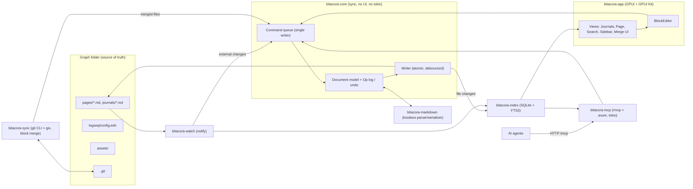

# Bitacora — Architecture

Bitacora is a cross-platform (Linux, macOS, Windows) desktop outliner written in Rust with a GPUI / [GPUI Kit](https://gpui-kit.com/) UI. It reads and writes **Logseq Markdown graphs** byte-compatibly, keeps its own SQLite index for fast navigation and search, syncs the graph with a git remote automatically, and runs an always-on **MCP server over Streamable HTTP** so AI agents can read and edit the graph.

This page is the entry point to the design. Detailed analyses and designs live in sibling pages; decisions taken across them are recorded in the ADR section below.

## 1. Goals

| # | Goal | MVP |
|---|---|---|
| G1 | 100% compatible with Logseq file graphs (0.10.x): same paths, file names, Markdown dialect, round-trip safe | Yes |
| G2 | Block outliner editing with the core Logseq keyboard model | Yes |
| G3 | Own indexing in SQLite (FTS5) — fast search, backlinks, journals, tasks | Yes |
| G4 | Automatic git sync; metadata conflicts auto-resolved; content conflicts shown visually per block; never leave conflict markers in files | Yes (basic), visual merge UI in M3 |
| G5 | MCP server over HTTP (localhost, token auth) | Yes (read tools + safe writes) |
| G6 | Cross-platform packaging and auto-update | M4 |

Non-goals (for now): Logseq DB graphs, Logseq Sync, plugins (JS), whiteboards editing, org-mode editing (`.org` files are preserved and indexed read-only), mobile.

## 2. Source documents

Logseq analysis (reference snapshot: Logseq tag `0.10.15`, file-graph code line):

- [[01-file-graph-layout]] — folders, config.edn, title ↔ file name encoding, journals, assets, rename/delete/backup behaviour.
- [[02-markdown-block-syntax]] — outline grammar, properties, refs, tasks, macros, serialization quirks, content vs metadata properties.
- [[03-parsing-indexing-search]] — parse pipeline, data model, path-refs, search, query DSL.
- [[04-editor-outliner-operations]] — editing model, outliner ops, write path, undo, shortcuts.
- [[05-git-and-apis]] — Logseq git auto-commit, HTTP API, plugin API surface.

Rust stack:

- [[gpui-and-gpui-kit]] — GPUI fundamentals, GPUI Kit components, text-editing strategy.
- [[crate-stack]] — crates, versions, workspace layout, CI matrix.

Bitacora designs:

- [[block-editor]] — document model, `Op` enum, transactions/undo, byte-preserving serializer, GPUI editor.
- [[sqlite-index-schema]] — DDL, indexing pipeline, search, query DSL → SQL.
- [[git-sync-merge]] — sync loop, git backend, block-aware 3-way merge, conflict UI.
- [[mcp-server]] — rmcp + axum Streamable HTTP, tools, resources, security.

## 3. System overview

Key rules:

1. **Files are the source of truth.** The SQLite index is a disposable cache, rebuildable from the graph at any time.
2. **Single writer.** UI, MCP and sync all mutate through the core command queue, so every change gets undo, echo suppression and consistent indexing.
3. **Byte-preserving writes.** Untouched blocks are written back verbatim; edited blocks use Logseq's canonical form. Minimal diffs → cleaner git history and merges.
4. **Only `bitacora-app` depends on GPUI Kit.** Everything else builds and tests headless.

## 4. Workspace layout

See [[crate-stack]] §5. Summary:

| Crate | Responsibility |
|---|---|
| `bitacora-markdown` | Lossless outline splitter, property/ref/inline scanners, serializer, round-trip tests |
| `bitacora-config` | `config.edn` read + comment-preserving edits; app settings |
| `bitacora-core` | Graph/Page/Block model, title ↔ path mapping, `Op` enum, transactions, undo, journals, command queue, writer |
| `bitacora-watch` | `notify` + debouncer, echo suppression |
| `bitacora-index` | rusqlite schema, migrations, incremental reindex, search, backlinks, query DSL → SQL |
| `bitacora-sync` | `GitBackend` (CLI + gix), sync loop, block-aware 3-way merge, conflict model |
| `bitacora-mcp` | rmcp tools/resources/prompts, axum Streamable HTTP, auth |
| `bitacora-app` | GPUI binary: views, BlockEditor, keymaps, themes, i18n, tokio bridge |
| `bitacora-cli` | Headless binary: `serve` (MCP without UI), `reindex`, `sync`, `doctor` |
| `bitacora-testkit` | Dev-only test helpers (fixture graphs, temp repos, golden files) |

## 5. Architecture decisions (ADR log)

| ID | Decision | Rationale / source |
|---|---|---|
| ADR-001 | UI = `gpui-kit = "=0.7.1"` (exact pin), reach GPUI only via `gpui_kit::gpui` | Avoid version skew with the `gpui-pre` snapshot it pins. [[gpui-and-gpui-kit]] |
| ADR-002 | Block editor is custom, built on GPUI `EntityInputHandler` (one text buffer per block) | No GPUI Kit component covers an outliner with inline refs. [[block-editor]] |
| ADR-003 | Custom line-based outline parser keeping raw bytes; `pulldown-cmark` only for rendering block bodies | Lossless round-trip is impossible with AST-based Markdown parsers. [[02-markdown-block-syntax]] |
| ADR-004 | SQLite via `rusqlite` (bundled, FTS5 word + trigram), single writer thread | [[sqlite-index-schema]] |
| ADR-005 | Index stored **outside** the graph, in the platform data dir (`<data_dir>/bitacora/graphs/<graph-hash>/index.sqlite`) | Keeps it out of git and out of Logseq's view; it is a cache. |
| ADR-006 | Block identity: session-stable ids in memory; `id::` written to the file **only** when a block is referenced/embedded (Logseq behaviour) | Avoid polluting files and diffs. Index rebuild re-derives ids; referenced blocks already have `id::`. |
| ADR-007 | Git: **hybrid backend** — git CLI for network and ref-writing ops (fetch, push, commit, clone), `gix` for reads and building merged trees; `git2` kept as fallback option behind the `GitBackend` trait | CLI gives working auth on all OSes (ssh config, agents, credential helpers, GCM). Supersedes the `git2`-first suggestion in [[crate-stack]]. [[git-sync-merge]] |
| ADR-008 | Merges of `.md` are done by Bitacora's block-aware 3-way merge; `*.md merge=binary` in `.git/info/attributes` so git never writes markers | [[git-sync-merge]] |
| ADR-009 | Metadata differences (`collapsed::`, `id::` additions, `:LOGBOOK:`, `card-*`, property order, whitespace, pure reorders) auto-resolve deterministically; content conflicts go to the visual per-block resolver | User requirement; classification table in [[02-markdown-block-syntax]] |
| ADR-010 | MCP: `rmcp` (~3.5) + axum 0.8 on a dedicated tokio runtime; `127.0.0.1` only, bearer token always required, Origin check, read-only by default | [[mcp-server]] |
| ADR-011 | Writes are atomic (temp + fsync + rename) with a pre-write hash check; external changes are merged, never silently overwritten | Logseq's `writeFileSync` is not atomic. [[04-editor-outliner-operations]] |
| ADR-012 | `bitacora-core` is synchronous and executor-agnostic; tokio only in `mcp`/`app` bridge | [[crate-stack]] |
| ADR-013 | Logseq naming: support both `:file/name-format :triple-lowbar` and legacy; missing key = legacy | [[01-file-graph-layout]] |
| ADR-014 | License MIT. Never copy code from GPL Zed crates; `cargo deny` license check in CI | GPUI is Apache-2.0; most Zed crates are GPL. |
| ADR-015 | **Clean-room compatibility with Logseq.** Logseq is AGPL-3.0: never copy or translate its source code, templates or test files into Bitacora. Re-implement behaviour from the specs in `docs/analysis/`, write our own test vectors (facts such as "`a/b` maps to `a___b.md`" are fine), and only use Logseq-produced graphs as fixtures when their license allows it | Keeps the MIT license valid. |

## 6. Milestones

| Milestone | Scope |
|---|---|
| M0 — Foundations & spikes | Workspace, CI 3-OS, GPUI Kit hello window, block-editor IME spike (1,000 blocks), parser round-trip harness |
| M1 — Read-only viewer (MVP-α) | Open a Logseq graph, parse, index, journals, page view, refs/backlinks, search, MCP read tools |
| M2 — Editor MVP (MVP-β) | Block editing, outliner ops, undo, atomic writes, watcher merge, autocomplete, rename cascade, MCP write tools |
| M3 — Git sync | Auto-commit, fetch/merge/push, block-aware merge, visual conflict resolver |
| M4 — Release 1.0 | Packaging, auto-update, settings, themes, queries, polish |

The backlog lives in gintrack project **BIT** (`docs/.pmngr`).

## 7. Open decisions

- Snapshot storage for external-edit 3-way merges (base = last content Bitacora wrote/read; stored compressed in the index DB vs in memory only).
- Auto-update channel (Velopack vs notice + download) — see [[crate-stack]].
- Minimum git version on macOS/Linux and MinGit bundling on Windows.
- The block-level 3-way merge is first needed in M2 for external edits (BIT-US-0069) and reused by git sync in M3 (BIT-EP-0012): implement it once in a shared module (`bitacora-core::merge` or a `bitacora-merge` crate) — decide before starting BIT-US-0069.
