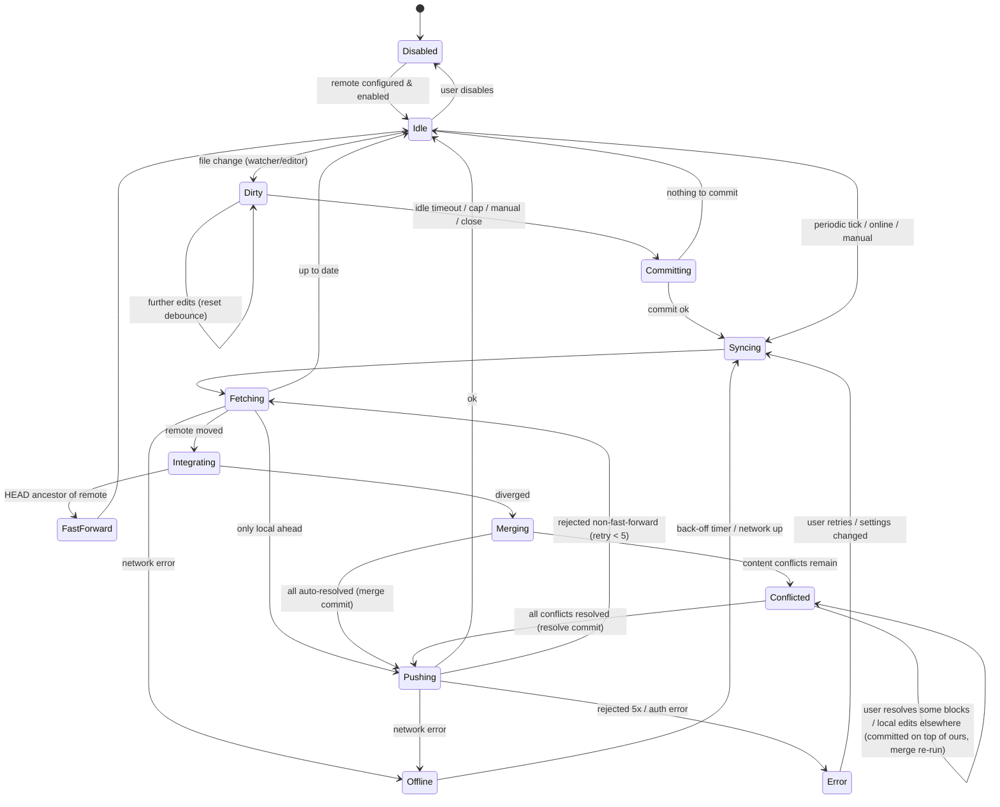

# Git sync and block-aware merge

## Summary

Bitacora keeps a Logseq Markdown graph synchronised with a git remote without the user ever touching git. A background **sync engine** commits local edits after a short idle period, fetches periodically, integrates remote work with a **block-aware 3-way merge**, and pushes with retry. Metadata-only differences (`collapsed::`, added `id::`, LOGBOOK clocks, `card-*` SRS properties, property order, whitespace, pure reorders) are resolved automatically by deterministic rules. Real content conflicts (the same block's text edited on both sides, delete-vs-edit, etc.) are **never** written as `<<<<<<<` markers: the merge stays pending, the working tree keeps the user's version, and the UI shows a per-block side-by-side resolver (ours / theirs / both / edit). Git plumbing uses the **system `git` CLI for network and ref-writing operations** (auth just works: ssh-agent, credential helpers, Git Credential Manager) and **`gix` for in-process reads** (status, blob/tree reads, merge-base); the merge itself is Bitacora's own code and git's merge driver is never used on `.md` files.

Context: Logseq only auto-commits locally on a fixed timer and has no conflict handling ([[05-git-and-apis]]). Block syntax is defined in [[02-markdown-block-syntax]]; edit operations in [[04-editor-outliner-operations]]; the index in [[sqlite-index-schema]]; the merge UI lives in [[block-editor]].

---

## 1. Goals and non-goals

**Goals**
- Zero-touch: works for a non-technical user once a remote URL is set.
- Never lose data; every state is recoverable from git (reflog + `refs/bitacora/*`).
- Never write conflict markers into graph files.
- Interoperate with other clients editing the same repo (Logseq desktop + git plugin, mobile with Working Copy/obsidian-git-style tools, plain `git`).
- Linear, readable history.

**Non-goals (v1)**
- Real-time collaboration (CRDT). Sync latency is seconds-to-minutes.
- Multiple branches / user-visible branching.
- Git LFS management (respected if present, not configured).
- Merging inside whiteboard `.edn`/`.tldr` files beyond whole-file policies.

---

## 2. Sync loop

### 2.1 Triggers

| Trigger | Default | Action |
|---|---|---|
| Local edit flushed to disk | debounce **idle 20 s** (min 5 s, max 10 min), plus a **hard cap 5 min** of continuous editing | `commit` then `sync` |
| Periodic | every **2 min** while app focused, **10 min** in background, exponential back-off when offline | `fetch` (+ `sync` if remote moved) |
| App start / graph open | immediate | `recover` → `commit` → `sync` |
| App close / graph close | blocking with 10 s budget | `commit` → `push` (best effort) |
| Network back online / laptop wake | immediate | `sync` |
| Manual "Sync now" / MCP `git_sync` | immediate | `commit` → `sync` |
| External file change (watcher) | joins the same idle debounce | `commit` |

"Flushed to disk" means the editor's file writer has written; commits never capture a half-typed block because the editor only writes on block blur / debounced save (see [[block-editor]]). The engine takes the **graph write lock** (same lock the editor's file writer and MCP writes use) while it stages and while it rewrites files during merge, so files are never mutated under it.

### 2.2 Strategy: fetch + rebase-like replay, merge commit only on divergence

We do **not** use `git rebase`/`git merge` porcelain on the work tree. Instead:

1. `fetch` `origin/<branch>`.
2. If `HEAD` is ancestor of remote → fast-forward (update files that changed; the editor reloads affected pages).
3. If remote is ancestor of `HEAD` → push.
4. If diverged → compute `base = merge-base(HEAD, remote)`, run the **Bitacora merge** per changed path (§4) producing a merged tree.
   - If **no unresolved conflicts**: create a **merge commit** (two parents) with the merged tree, update work tree, push. (A merge commit rather than a rebase: rebasing rewrites local commits that may already be pushed by another instance of the same user, and a single merge commit is a cleaner audit point for "what the robot decided". History stays readable because auto-commits are squashed while unpushed — see §2.4.)
   - If **conflicts remain**: enter `Conflicted` state (§3). Local work tree keeps "ours" for conflicting blocks plus auto-resolved remote changes everywhere else; the pending merge is stored in `refs/bitacora/pending-merge` (tree + metadata JSON in `.git/bitacora/merge-state.json`). The user resolves in the UI; then the merge commit is created and pushed.
5. Push with `--force-with-lease`? **No** — plain push only; a non-fast-forward rejection loops back to step 1 (max 5 attempts with jitter 1–8 s), then `Error(PushRejectedLoop)`.

### 2.3 Offline

Fetch/push failures with network errors set `Offline`; commits continue locally (they are cheap). Back-off: 30 s, 1 m, 2 m, 5 m, 10 m cap; reset on OS network-change events. The status bar shows "N local commits not synced".

### 2.4 Commits and messages

- Identity: per-repo `user.name`/`user.email` from Bitacora settings (never `--global`); `Bitacora <device@hostname>` fallback.
- Auto-commit message (first line ≤ 72 chars, body machine-parseable):

```
bitacora: edit 3 pages (journals/2026_10_06, Project X, Ideas)

Bitacora-Device: laptop-jose
Bitacora-Kind: auto
Bitacora-Pages: journals/2026_10_06.md; pages/Project X.md; pages/Ideas.md
```
- Kinds: `auto`, `manual` (user message), `merge`, `resolve` (conflict resolution), `agent` (writes coming from MCP, with `Bitacora-Agent: <client name>` trailer), `migrate`.
- **Squash unpushed auto commits**: if the last commit is `Kind: auto`, from this device, unpushed and younger than 30 min, amend it instead of creating a new commit. This keeps history to ~1 commit per editing session per device. Never amend pushed commits.
- Commit is skipped when only ignored/volatile files changed.

### 2.5 State machine



Rules while `Conflicted`:
- The user can keep editing. Edits to non-conflicting blocks are fine. Edits to a conflicting block in the editor count as "edit" resolution for that block.
- Periodic fetch continues; if the remote moves again, the merge is recomputed from the new remote with the same base and previously chosen resolutions are re-applied by block identity (resolution memo, like `git rerere` at block level).
- Nothing is pushed until conflicts are resolved (local auto commits continue on the local branch so nothing is lost).

### 2.6 Recovery

On start: if `.git/bitacora/merge-state.json` exists → restore `Conflicted`. If a native git operation was interrupted (`.git/index.lock` stale > 10 min and no git process) → remove lock. If the repo is mid `git rebase`/`git merge` done by the user externally → `Error(ExternalOperationInProgress)` with a "let Bitacora abort it / I'll fix it" choice. If tracked files contain `^<<<<<<< ` / `^>>>>>>> ` lines (inserted by another tool) → parse them as an external conflict and offer the same resolver (§5.4).

---

## 3. Library choice

| Option | Pros | Cons |
|---|---|---|
| **git2** (libgit2 bindings, v0.21.0, May 2026) | Mature, complete API (merge-base, index, merge_trees with custom file favor, push), widely used | C dependency (libgit2 + libssh2 + OpenSSL on Linux); **auth is the weak spot**: no `~/.ssh/config` (`Host` aliases, `IdentityFile`, `ProxyJump`), no ssh-agent on Windows' OpenSSH pipe without work, credential helpers must be emulated via `git2::CredentialHelper` (partial), no Git Credential Manager OAuth flows; no `core.sshCommand`; shallow/partial clones limited |
| **gix** (gitoxide, v0.88.0, Sept 2026) | Pure Rust, fast, safe, good for status/diff/blob reads, merge-base, tree diff; per `crate-status.md` now also has push, tree merge, checkout/reset | Pre-1.0 API churn (minor bumps break); network transport shells out to `ssh` (good) but HTTP auth goes through its own credential-helper implementation; newest write paths (push, rebase) less battle-tested than git CLI |
| **git CLI** (`std::process::Command`) | Exact behaviour users expect; **all auth works**: `~/.ssh/config`, ssh-agent / Pageant / 1Password agent, `credential.helper` (osxkeychain, libsecret, manager), GCM OAuth for GitHub/GitLab/Azure; hooks, signing, LFS respected | Needs git installed (macOS: Xcode CLT; Windows: Git for Windows); parse porcelain output; process spawn cost (~5–20 ms) |

**Recommendation: hybrid with a pure-Rust fallback (ADR-007 amended by ADR-020)**
- **Git is not bundled** (no MinGit, ADR-020). At startup Bitacora detects a system `git` on `PATH` (or `sync.git_binary`) and checks the minimum version (≥ 2.38). If found, the hybrid split below applies (`CliBackend` + `GixBackend`). If not found (or too old), a **gix-only backend** handles everything, including fetch/push/clone/commit/update-ref: HTTPS credentials via gix's credential handling backed by the OS keyring (`keyring` crate) and the in-app prompt, SSH via the gix transport. The UI shows which backend is active and, when auth fails on the gix fallback, suggests installing git.
- **Network + ref-writing ops via git CLI**: `fetch`, `push`, `commit` (plain `git commit`, so user hooks and signing config apply; merge commits are built with `git commit-tree` + `git update-ref` from the tree that gix wrote), `clone`, `ls-remote`. Run with `GIT_TERMINAL_PROMPT=0`, `GIT_ASKPASS=<bitacora askpass helper>` (prompts in the app UI when a helper has nothing), `LC_ALL=C`, `-c core.quotepath=false`, `-c core.autocrlf=false`. Used only when a system git ≥ 2.38 is detected; git is never bundled (ADR-020).
- **Read-side via `gix`**: status/dirty detection, reading base/ours/theirs blobs, merge-base, tree diffs with rename detection, building the merged tree objects (`write_blob`, tree editor). This avoids hundreds of process spawns during a merge and keeps the merge pure Rust and testable.
- Abstract behind a `GitBackend` trait (`fetch`, `push`, `merge_base`, `read_blob`, `diff_trees`, `write_tree`, `commit`, `update_ref`, `status`) with a `CliBackend` and `GixBackend`; the `GixBackend` also implements the network and ref-writing ops so it can run alone (ADR-020). Tests use a temp-dir repo, and the sync integration suite runs against both backends (CLI-hybrid and gix-only).
- Never let git's text merge touch `.md`: put `*.md merge=binary` (and `logseq/config.edn merge=binary`) in `.git/info/attributes`. With the built-in `binary` driver an accidental `git merge`/`git pull` run by the user keeps "ours" in the work tree and marks the path conflicted **without inserting markers**; Bitacora detects the unmerged index entries on its next tick and resolves those paths with its own merge (§5.4).

---

## 4. Block-aware 3-way merge

The algorithm of this section (model, matching, classification, `merge_page`, byte-preserving emit) lives in the crate **`bitacora-merge`** (`crates/bitacora-merge/`, depends only on `bitacora-markdown`), so `bitacora-sync` (git) and `bitacora-core` (external edits, [[block-editor]] §6.2) share one implementation (ADR-016). `bitacora-sync` keeps only the git-specific parts: orchestration over trees, renames, persisted merge state, resolution memo and external-marker import.

### 4.1 Model

Each `.md` page file parses (with the Bitacora parser, [[02-markdown-block-syntax]]) into:

```
Page { pre_block: Option<Props>, blocks: Vec<Block> }
Block {
  key: BlockKey,                 // id:: uuid, or synthetic (see 4.2)
  content: String,               // first line + continuation lines, normalised
  props: OrderedMap<String,String>, // non-meta properties
  meta: Meta { collapsed, id, logbook: Vec<Clock>, card_* , other volatile },
  children: Vec<Block>,
  raw: Span                      // original bytes, reused when unchanged
}
```
Normalisation for comparison (not for output): trim trailing whitespace per line, unify `\r\n`, unify indentation unit (tab vs 2 spaces, per file), properties compared as a set, LOGBOOK compared as a set of clock entries.

### 4.2 Block identity matching

Across base/ours/theirs:
1. **Explicit**: equal `id::` property → same block.
2. **Synthetic** for blocks without `id::`, in order:
   a. exact normalised content + same parent key → match;
   b. per parent, LCS over children by content hash (Logseq does similar 2-way diff via `@logseq/diff-merge`);
   c. fuzzy: remaining unmatched blocks under the same (or moved) parent with similarity ≥ 0.6 (token Jaccard / normalized Levenshtein on first line) → match, best-first, one-to-one;
   d. otherwise: distinct (insert/delete).
3. If ours added `id::` to a block that theirs didn't touch (typical: a block got referenced), the synthetic match in (2) still holds, and the `id::` addition is a metadata change.
4. Duplicate `id::` within a file (corruption) → the second occurrence is treated as a new block and gets a fresh uuid in the merge output; logged.

### 4.3 Change classification per matched block (base B, ours O, theirs T)

| Field | Rule |
|---|---|
| content | standard 3-way: if O==B take T; if T==B take O; if O==T take either; else **try line-level diff3 inside the block** (non-overlapping edits on different lines merge cleanly, e.g. two people appended different lines to a multi-line block); still overlapping → **CONFLICT(content)** |
| user properties (`key:: value`) | per key 3-way; both changed same key differently → CONFLICT(property) (shown inline in the same block card) |
| `id::` | union; if both added different ids to the same matched block → keep the one **referenced** elsewhere in the graph (index lookup), else lexicographically smaller; rewrite refs `((uuid))` of the loser across the merge result |
| `collapsed::` | prefer ours (UI state of this device); if ours unchanged take theirs |
| LOGBOOK / `:LOGBOOK:` clocks | set-union of CLOCK entries, sorted by start time; open clocks: keep the latest |
| `card-*` (SRS: `card-last-interval`, `card-repeats`, `card-ease-factor`, `card-next-schedule`, `card-last-reviewed`, `card-last-score`) | take the whole `card-*` group from the side with the later `card-last-reviewed` (never mix fields across sides) |
| property order | output order = ours order, plus new keys from theirs appended in theirs' relative order |
| whitespace / indentation style | irrelevant to equality; output uses ours' file style |
| position (parent, sibling order) | 3-way on (parent, left-sibling): one side moved → take that move; both moved to different places → take **ours** and record an *info* note (not a conflict) — moves are cheap to redo and nagging the user costs more |
| `TODO/DOING/DONE` marker | part of content but merged with a rule: if one side changed only the marker and the other changed only text, combine both; if both changed the marker → prefer the "more advanced" state (`DONE` > `CANCELED` > `DOING/NOW` > `TODO/LATER`)… only when text is otherwise identical; else content conflict |
| `SCHEDULED`/`DEADLINE` | per-line 3-way; both changed → conflict(property) |

Structure-level cases:

| Case | Resolution |
|---|---|
| inserted on one side | insert, positioned after its left sibling's match (or at the end of parent if left sibling vanished) |
| inserted on both sides at the same place | keep both, ours first; if normalised content identical → dedupe |
| deleted on one side, unchanged on other | delete (children too, unless a child was modified on the other side → CONFLICT(delete-vs-modify) at the child) |
| deleted on one side, modified on other | **CONFLICT(delete-vs-modify)** |
| deleted on both | delete |
| parent deleted on one side, child added under it on the other | re-attach new child to the nearest surviving ancestor; info note |
| reorder only (same content set, different sibling order) | 3-way list merge of sibling order (ours wins on overlap); never a conflict |

### 4.4 Algorithm (pseudocode)

```text
fn sync_merge(repo):
    base_c   = merge_base(HEAD, REMOTE)
    changes  = diff_trees(base_c, HEAD) ∪ diff_trees(base_c, REMOTE)   // with rename detection
    result_tree = tree(HEAD)
    conflicts = []
    for path in changes.paths():
        (b, o, t) = (blob(base_c, path_base), blob(HEAD, path_ours), blob(REMOTE, path_theirs))  // follows renames
        policy = policy_for(path)                       // §5
        match policy:
          Markdown  => r = merge_page(b, o, t)
          Config    => r = merge_edn(b, o, t)
          Binary    => r = merge_binary(b, o, t)
          TextLine  => r = diff3_lines(b, o, t)         // css, js, plain text
          Ignore    => continue
        result_tree.put(final_path(path), r.output)     // output always clean text (ours for conflicting regions)
        conflicts += r.conflicts
    if conflicts.empty():
        commit_merge(result_tree, parents=[HEAD, REMOTE], kind="merge", notes=info_notes)
        checkout_changed_files(result_tree); reindex(changed); push()
    else:
        save_merge_state(base_c, HEAD, REMOTE, result_tree, conflicts)
        write_worktree(result_tree)                     // includes auto-resolved remote changes
        state = Conflicted

fn merge_page(b, o, t) -> MergeResult:
    if o == t: return clean(o)
    if b == o: return clean(t)
    if b == t: return clean(o)
    B, O, T = parse(b), parse(o), parse(t)              // tolerant parser; on parse failure → diff3_lines
    m = match_blocks(B, O, T)                           // §4.2 → triples (bB?, bO?, bT?)
    out = Page(); confl = []
    out.pre_block = merge_props(B.pre, O.pre, T.pre, &confl)
    for triple in m.in_output_order(prefer=O):          // ordering via 3-way sibling-list merge
        match classify(triple):
          Unchanged | OnlyOurs | OnlyTheirs | Same => out.emit(pick(triple))
          BothChanged =>
             blk = merge_fields(triple, &confl)         // content diff3, props, meta rules of §4.3
             out.emit(blk)                              // conflicting fields hold OURS value
          DeletedVsModified => out.emit(modified_side); confl.push(DeleteVsModify(triple))
          ...
    text = serialize(out, style=O.style, reuse_raw_spans=true)  // unchanged blocks byte-identical
    assert parse(text) roundtrips
    return MergeResult { output: text, conflicts: confl }
```

Serialization reuses original raw spans for untouched blocks so a merge never reformats a file (critical for interop with Logseq, which would otherwise see spurious diffs).

### 4.5 Conflict record (persisted in `merge-state.json`, consumed by the UI)

```json
{
  "id": "c-7f3a",
  "path": "pages/Project X.md",
  "kind": "content | property | delete_vs_modify | file_delete_vs_modify | rename_rename | binary | config",
  "block_key": "6650e1f2-…",              // or synthetic key + breadcrumb
  "breadcrumb": ["Project X", "Milestones", "Q4"],
  "base": "…", "ours": "…", "theirs": "…",
  "ours_commit": "a1b2…", "theirs_commit": "c3d4…",
  "theirs_author": "phone-jose", "theirs_time": "2026-10-06T08:12:00Z",
  "resolution": null                       // "ours" | "theirs" | "both" | {"edit": "..."}
}
```

### 4.6 Visual merge UI (summary; detail in [[block-editor]])

- A "Conflicts (N)" banner in the status bar and on each affected page header.
- Conflict view: one card per conflict, grouped by page, with breadcrumb, **side-by-side** rendered blocks (ours | theirs) with word-level diff highlighting against base, and actions **Keep mine / Keep theirs / Keep both** (theirs inserted as next sibling, `id::` regenerated for the copy) / **Edit** (inline editor seeded with a diff3 text, no markers — the user sees both versions above).
- Delete-vs-modify: "Keep (modified)" / "Delete".
- "Resolve all on this page with mine/theirs" bulk actions; keyboard shortcuts.
- While unresolved, the page shows ours content with a subtle marker on conflicted blocks; clicking jumps to the resolver.
- After the last resolution: write files, create `resolve` merge commit (parents HEAD-local, REMOTE), push.

---

## 5. Special files and situations

### 5.1 Policies per path

| Path | Policy |
|---|---|
| `pages/**/*.md`, `journals/*.md` | block merge (§4) |
| `logseq/config.edn` | EDN-aware 3-way map merge (parse with an EDN reader; per top-level key 3-way; nested maps recurse; vectors/sets: union for sets, 3-way list for vectors); comments preserved by applying changes as text edits on ours when possible; on parse failure or same-key conflict → conflict(config) with whole-key ours/theirs choice |
| `logseq/custom.css`, `logseq/custom.js` | line diff3; overlap → conflict shown as a text side-by-side |
| `whiteboards/*.edn` / `draws/*.excalidraw` / `.tldr` | whole-file: newer commit wins for **auto** sync if the other side is unchanged; if both changed → keep both: theirs saved as `<name> (conflict <device> <date>).edn` + info notification (no merge of shapes in v1) |
| `assets/**` (binary) | identical bytes → no-op; one side changed → take it; both changed/added differently → keep ours at the path, save theirs as `name (conflict-<short-sha>).ext`, notify (no automatic link rewriting). Logseq asset names already carry a timestamp suffix, so real collisions are rare |
| `logseq/pages-metadata.edn`, `logseq/graphs-txid.edn` | ignored (gitignored); if tracked from legacy repos, take ours |
| `logseq/bak/**`, `logseq/.recycle/**`, `logseq/version-files/**` | ignored |
| `.gitignore`, other text | line diff3 |

### 5.2 Default `.gitignore` (written only if absent; appended entries if present and missing)

```
# Bitacora / Logseq volatile files
.DS_Store
Thumbs.db
logseq/bak/
logseq/.recycle/
logseq/version-files/
logseq/graphs-txid.edn
logseq/pages-metadata.edn
logseq/.bitacora/          # local index (SQLite), caches, device state
.trash/
*~
```
The SQLite index ([[sqlite-index-schema]]) lives in `logseq/.bitacora/index.sqlite` (or the OS cache dir); it is always rebuildable and never committed. Device-specific UI state (open sidebar, `collapsed` mirror if we move it out of files later) also goes there.

`.git/info/attributes` (local, not committed): `*.md merge=binary` and `logseq/config.edn merge=binary` (see §3) and `* -text` to avoid CRLF conversion surprises (we normalise ourselves).

### 5.3 Journals created concurrently

Two devices each create `journals/2026_10_06.md` (add/add, no base). Treat base as empty page and run the block merge: both sides' blocks are inserts → union, ours first, dedupe identical blocks. Special-case: a side whose content is only the default journal template / `-` / empty is treated as "unchanged" (Logseq precedent `src/main/frontend/fs/watcher_handler.cljs:95-101`) → take the other side. Same for any page add/add.

Bitacora should **not** create today's journal file on disk until the user types into it (the empty page is virtual), which removes most of these collisions.

### 5.4 External conflict markers

If a file in the tree contains a well-formed marker region (`<<<<<<< `, optional `||||||| `, `=======`, `>>>>>>> `): split into ours/base/theirs texts, run `merge_page`, write clean result, and register remaining conflicts in the resolver. Malformed markers → conflict(kind=external_markers) showing the raw file; never index marker lines as block content.

### 5.5 Renames

Page rename in Logseq/Bitacora = file rename + `title::` change + link rewrites in many files. Detect renames with gix rename tracking (similarity ≥ 50%, plus identical `id::` sets as a strong signal).
- Renamed on one side, modified on other → apply modifications to the renamed path (block merge using base path ↔ new path).
- Renamed differently on both sides (rename/rename) → conflict(rename_rename): pick a title; the other title becomes an `alias::` automatically (suggested default).
- Link rewrites across other files are just content changes and merge normally; a remote side adding a new `[[Old Name]]` link after we renamed → post-merge fix-up pass: rewrite links to renamed pages (logged in the merge commit message as an info note).
- Case-only renames on case-insensitive FS (macOS/Windows): do via temp name.

### 5.6 Deleted vs modified (file level)

- Deleted ours, modified theirs → conflict(file_delete_vs_modify): "Restore page with their changes" / "Keep deleted". Default suggestion: restore.
- Deleted theirs, modified ours → same, mirrored.
- Logseq moves deleted pages to `logseq/.recycle` (ignored) — no special handling needed.

### 5.7 Line endings and encoding

Read as UTF-8 (BOM stripped and restored per file), compare normalised, write with the file's original line ending (ours). Non-UTF-8 `.md` → treated as binary policy.

---

## 6. Interaction with the rest of the app

- The sync engine is a single async task (tokio) per graph, owning a `GitBackend`; it communicates via a command channel and publishes `SyncStatus` (state, ahead/behind, last sync, conflicts count, last error) on a watch channel, consumed by the UI status bar and by MCP `git_sync_status` ([[mcp-server]]).
- File writes performed by the merge go through the same file-writer service as editor/MCP writes, which updates the index ([[sqlite-index-schema]]) and notifies open editors; open editors with unsaved typing in an affected block are flushed **before** the merge starts (engine requests `flush_all` and waits).
- Undo: a merge is an undo boundary; undo across a sync is disabled for blocks changed by the merge (redo stack cleared for those pages).
- MCP agent writes are committed with `Kind: agent` so they are reviewable/revertible.

---

## 7. Settings

| Setting | Default |
|---|---|
| `sync.enabled` | off until remote set |
| `sync.remote` / `sync.branch` | `origin` / current branch (`main`) |
| `sync.commit_idle_secs` | 20 |
| `sync.commit_max_secs` | 300 |
| `sync.fetch_interval_secs` | 120 (foreground), 600 (background) |
| `sync.squash_auto_commits` | true |
| `sync.author_name/email` | from onboarding |
| `sync.collapsed_policy` | `ours` |
| `sync.git_binary` | auto-detect on `PATH`; none found → gix-only backend (ADR-020) |

---

## 8. Implementation notes (BIT-US-0044 / BIT-US-0045)

- **Threading (amends 6):** the engine (`bitacora_sync::engine::SyncEngine`) is a synchronous state machine driven by a command channel on its own `std::thread` (`engine::spawn`); no tokio. Time, sleeping and jitter come from a `Timing` trait so tests do not wait.
- **Writer seam:** the engine never writes graph files. `writer::GraphWriter::acquire()` flushes editors and pending writes and returns a `GraphLock`; `GraphLock::apply(&[FileChange])` is the only way merge output reaches the work tree, with an `expected` content per file (stale -> nothing applied). `Busy` means "a write transaction is pending": the cycle defers (state `Dirty`, retry after `busy_retry`). Core implements the trait with its command queue (BIT-US-0062); `writer::testing::DirGraphWriter` is the test fake.
- **Integration order:** files first through the writer, then `update-ref` (CAS) and `reset_index`, so a crash never leaves a HEAD that silently reverts remote work.
- **Conflicted:** the merge plan is applied to the work tree (ours for conflicting regions), the merged tree is anchored as a commit with parents `[ours, theirs]` in `refs/bitacora/pending-merge`, and the conflicts live behind the `MergeStateStore` trait (`MemoryMergeStore` until BIT-US-0053 persists them). `finish_pending_merge()` is the resolver's seam: it commits the work tree and creates the two-parent `resolve` commit.
- **Policies applied (5.1):** markdown via `merge_page`; `logseq/config.edn` and other text via `merge_lines` (clean diff3 is accepted, overlap becomes a `config`/`text` conflict keeping ours; the EDN-aware merge is still open); whiteboards, draws and binary files keep ours and save theirs as `<name> (conflict-<short sha>).<ext>` plus a note (the design's `<device> <date>` naming needs data a commit does not carry); add/add of a blank or `-` page takes the other side; deleted-vs-modified files keep ours and record `file_delete_vs_modify`.
- **Not yet done:** `MergeEnv.prefer` (newest writer) is always ours because `Side` is not re-exported by `bitacora-merge`; resolution memo (rerere); external-marker import and unmerged-index resolution (R8) report `ExternalOperationInProgress`; the app-close 10 s budget relies on the CLI timeouts.

---

## Requirements for Bitacora

- **MUST** commit after an idle debounce (default 20 s) with a hard cap, never on a blind fixed interval.
- **MUST** fetch periodically and on demand, integrate remote changes, and push with bounded retry; work fully offline with local commits.
- **MUST** never write `<<<<<<<`/`=======`/`>>>>>>>` markers into graph files, and **MUST** protect against external merges inserting them (`merge=binary` attributes + marker detection).
- **MUST** auto-resolve metadata-only differences by the deterministic rules of §4.3 (`collapsed::`, `id::` additions, LOGBOOK, `card-*`, property order, whitespace, reorders).
- **MUST** surface content conflicts (same block edited both sides, delete-vs-modify, rename/rename, binary/config collisions) in a per-block visual resolver with ours/theirs/both/edit.
- **MUST** keep the user's local version in the work tree while conflicted, persist merge state across restarts, and push nothing until resolved.
- **MUST** reuse original bytes for untouched blocks so merges never reformat files.
- **MUST** use git CLI for fetch/push so SSH agent, `~/.ssh/config`, credential helpers and GCM work on Linux/macOS/Windows; **MUST** set `GIT_TERMINAL_PROMPT=0` and provide an in-app askpass.
- **MUST** store identity in repo-local config only.
- **MUST** write/maintain a default `.gitignore` excluding `logseq/bak/`, `logseq/.recycle/`, `logseq/version-files/`, `logseq/.bitacora/`, volatile Logseq caches.
- **SHOULD** use `gix` for in-process reads/tree building and keep the git layer behind a trait.
- **SHOULD** squash unpushed auto-commits from the same device within a session window.
- **SHOULD** treat empty/template-only journal files as unchanged in add/add merges and avoid creating empty journal files on disk.
- **SHOULD** record agent writes as `Kind: agent` commits with trailers.
- **SHOULD** remember block-level resolutions (rerere-like) when the remote moves during an unresolved merge.
- **SHOULD** offer per-page history with block-level diff and selective restore from git.

## Open questions

1. Merge commits vs strict linear history (replay local commits onto remote = "rebase")? Merge chosen for safety; revisit if users dislike the graph shape.
2. Should `collapsed::` be moved out of files into device-local state (fewer diffs) while keeping Logseq compatibility (Logseq writes it)?
3. Fuzzy matching threshold (0.6) and the risk of mis-pairing short blocks like "- TODO" — needs a corpus test from real graphs. **Partially resolved (BIT-T-0352):** blocks with fewer than 4 first-line tokens never match fuzzily (only exactly, under a matched parent, LCS-ordered), and cross-parent (moved) fuzzy matching requires >= 4 tokens. `crates/bitacora-merge/tests/matcher_accuracy.rs` synthesizes edits (word appends, leaf deletes, inserts, sibling swaps) over `fixtures/graphs/**` (166 pages, 3413 pairs): precision 1.000, recall 1.000 (thresholds 0.99 / 0.95). A real-world corpus is still desirable.
4. Should Bitacora auto-add `id::` to every block (stable identity, better merges) at the cost of noisier files vs Logseq's "only when referenced"?
5. ~~Bundle git on macOS/Linux too or require system git?~~ **Resolved (ADR-020):** never bundle; use system git when present, else the gix-only backend.
6. Whiteboards: is a shape-level merge (tldraw JSON by shape id) worth doing in v2?
7. Multiple remotes / multi-branch per device for "drafts"? Out of scope for v1.
8. **gix 0.88 has no push client** (checked in the gix-0.88 sources). The gix-only backend therefore implements `push` for local (`file://`/path) remotes by copying missing objects and compare-and-swapping the remote ref (fast-forward only); pushing to HTTPS/SSH remotes without system git returns `GitError::Unsupported` ("install git") until upstream gix gains a push or a pure-Rust push is written. gix `file://` fetch/clone also spawns `git-upload-pack`, so a fully git-less host works only for HTTPS/SSH fetch/clone. Tracked as a follow-up; the HTTPS credential provider (BIT-T-0374) is not part of BIT-US-0042.
